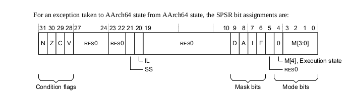
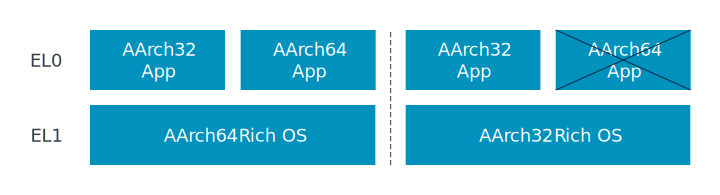
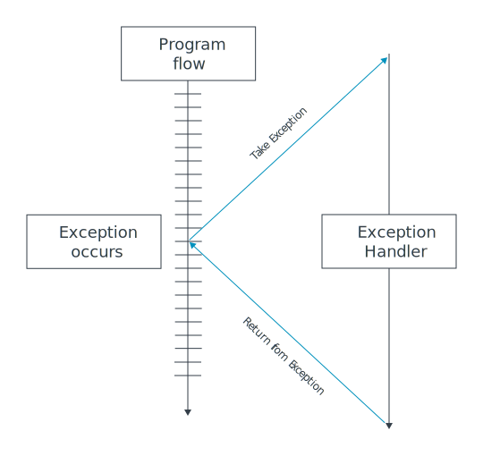

# Exception Levels

The ARMv8-A architecture defines a set of Exception levels, EL0 to EL3, where:
- If ELn is the Exception level, increased values of n indicate increased software execution privilege.
- Execution at EL0 is called ***unprivileged execution***.
- EL2 provides support for virtualization of Non-secure operation.
- EL3 provides support for switching between two Security states, Secure state and Non-secure state.

		Note:
		A PE is not required to implement a contiguous set of 
		Exception levels. For example, it's permissible for an
		implementation to include only EL0, EL1, and EL3.

Each exception type has a target Exception level that is either: 
- Implicit in the nature of the exception.
- Defined by configuration bits in the system control registers.

An exception cannot target EL0.

### Typical Exception level usage model
The architecture doesn't specify what software uses which Exception level. Such choices are outside the scope od the architecture.  
However, the following is a common usage model for the Exception levels: 
* **EL0**  Applications. 
* **EL1**  OS kernel and associated functions that are typically described as ***privileged***.  
* **EL2** Hypervisor.
* **EL3** Secure monitor.

An Exception level with a smaller value of n than another Exception level is desribed as being a higher Exception level than the other Exception level. 

An Exception level is described as:
* Using AArch64 when execution in that Exception level is in the AArch64 Execution state.

### Definintion of synchronous and asynchronous exceptions
1.   An exception is described as synchronous if all of the following apply:
* The exception is generated as result of direct execution or attempted execution of an instruction.
* The return address presented to the exception handler is guaranteed to indicate the instruction that caused the exception.
* The exception is precise.

2.   An exception is described as asynchronous if any of the following apply:
* The exception is not guaranteed as a result of direct execution or attempted execution of the instruction stream.
* The return address presented to the exception handler is not guaranteed to indicate the instruction that caused the exception.
* The exception is imprecise.

### The stack pointer
In AArch64 state, in addition to the general purpose registers, a dedicated stack registers is implemeted Exception level. The stack pointer registers are:
* SP_EL0 and SP_EL1
* If the implementation includes EL2, SP_EL2.
* If the implementation includes EL3, SP_EL3.

		Note:
		The four stack pointer register names define an architecture
		state requirement for four registers.

### Saved Program Status Registers(SPSRs)
The ***Saved Program Status Registers (SPSRs)*** are used to save PE state on taking exceptions.

In AArch64 state, there is an SPSR at each Exception level exceptions can be raken to, as follows:
* **SPSR_EL1**, for exceptions taken to EL1 using AArch64.
* If EL2 is implemented, **SPSR_EL2**, for exceptions taken to EL2 using AArch64.
* If EL3 is implemented, **SPSR_EL3**, for exceptions taken to EL3 using AArch64.

When the PE takes an exception, PE state is saved in the SPSR at the Exception level the exception is taken to. For example, if the PE takes an exception to EL1, PE state is saved in **SPSR_EL1**.

		--Note--
		Exceptions cannot be taken to EL0.

### SPSR format for exceptions taken to AArch64 state
Exceptions can be taken to AArch64 state from AArch64 state or AArch32 state.

For an exception taken to AArch64 state from AArch64 state, the SPSR bit assignments are:

#### The PSTATE debug mask bit, D
As with all other exceptions, when a debug exception is taken, software must take carre to avoid generating another instance of an exception within the exception handler, to avoid recursive entry into the exception handler and loss of return state.

PSTATE.D is set to 1 on taking an exception. This means that while handling an exception in AArch64 state, Watchpoint, Breakpoint, and Software Step exceptions are masked. This prevents recursive entry at the Exception level that debug exceptions are targeted to.

As shown in Exception levels, there are four Exception levels:  
**EL0, EL1, EL2, EL3**

	The Exception level can only change when any of the following occur:
	- Taking an Exception
	- Returning from an exception 
	- Processor reset
	- During Debug state
	- Exiting from Debug state

# Memory privilege
	Memory access initiated when the processor is executing in EL0 are checked against the unprivileged access permissions. 
	Memory accesses from EL1, EL2, and EL3 are checked against the privileged access permissions.

	***Because this memory configuration is programmed by software using the MMU's translation tables, you should consider the privileged access permissions.***

	Note:
	In the Arm architecture, registers are split into two main categories:
	- Registers that provide system control or status reporting
	- Registers that are used in instruction processing,
	for example to accumulate a result, and in handling exception.

# Register access
	There is a System Control Register(SCTLR) for each implemented Exception level. Each register controls the architectural features for that EL, such as the MMU, caches and alignment checking:

	- SCTLR_EL1: Top-level system control for EL0 and EL1.

	EL1 and EL0 share the same MMU configuration and 
	control to privileged code running at EL1.

	- SCTLR_EL2: Top-level system control for EL2.-
	- SCTLR_EL3: Top-level system control for EL3.-

	Higher Exception levels have the privilege to access registers that control lower levels. For example, EL2 has the privilege to access SCTLR_EL1 if neccessary.

	The following System registers are discussed in relation to the AArch64 Exception model in this guide:

| Register | Name | Description | 
|----------|------|------------ |
|Exception Link Register | ELR_ELx | Holds the address of the instruction which caused the exception |
|Exception Syndrome Register| ESR_ELx| Includes information about the reasons for the exception|
|Fault Address Register| FAR_ELx|Holds the virtual faulting address|
|Hypervisor Configuration Register| HCR_ELx|Controls virtualization settings and trapping of exceptions to EL2|
|Secure Configuration Register| SCR_ELx| Controls Secure state and trapping of exceptions to EL3|
|System Control Register| SCTLR_ELx |Controls standard memory, system facilities, and provides status information for implemented functions|
|Saved Program Status Register| SPSR_ELx | Hold the saved processor state when an excpetion is taken to this ELx|
|Vector Base Address Register| VBAR_ELx | Holds the exception base address for any exception that is taken to ELx|

## Changing Exection state
When the PE moves between Exception levels it is possible to change Exection state, however transitioning between AArch32 and AArch64 is only allowed subject to additional rules:
- When moving from a lower Exception level to a higher level, the Exection state can stay the same or change to AArch64.

The following diagram illustrate these scenarios:

***The Execution state of each Exception level is defined by the control register at the next higher implemented Exception level. This utilizes the Hypervisor Configuration Register (HCR_EL2) at EL2 and the Secure Configuration Register (SCR_EL3) at EL3.***

## Exception types
Exceptions are conditions or system events that usually require remedial action or an update of system status by privileged software to ensure smooth functioning of the system.

Exceptions are used for many different reasons, including the following:
- Emulating virtual devices.
- Virtual memory management.
- Handling software errors. 
- Handling hardware errors. 
- Debugging.  
- Performing calls to different privilege or security states. 
- Handling interrupts(timer, device interactions) 
- Handling across different Execution states(known as interprocessing)

When an exception is taken, instead of moving to the next instruction in the current code, the processor stops current execution and branches to a piece of code to deal with the request. This code is known as an exception handler.

## Synchronous exception
If the following all apply, then an exception is synchronous:
- The exception has been generated as a result of direct, or attempted, execution of an instruction.
- The address to return to once the exception has been handled (return address) has an architecturally-defined relationship with the instruction that caused the exception.

- The exception is precise, meaning the register state presented on entry to the exception handler is consistent with every instruction before the offending instruction having been execution, and none after it.

## Invalid 
